# AWS Terraform Docker Kubernetes Deployment

## Project Overview

This project demonstrates the deployment of a containerized NGINX web application using Docker Desktop and Kubernetes, while provisioning AWS infrastructure using Terraform.

The project combines Infrastructure as Code (Terraform), containerization (Docker), and container orchestration (Kubernetes) to simulate a modern cloud-native deployment workflow.

## Screenshots

### Kubernetes Cluster

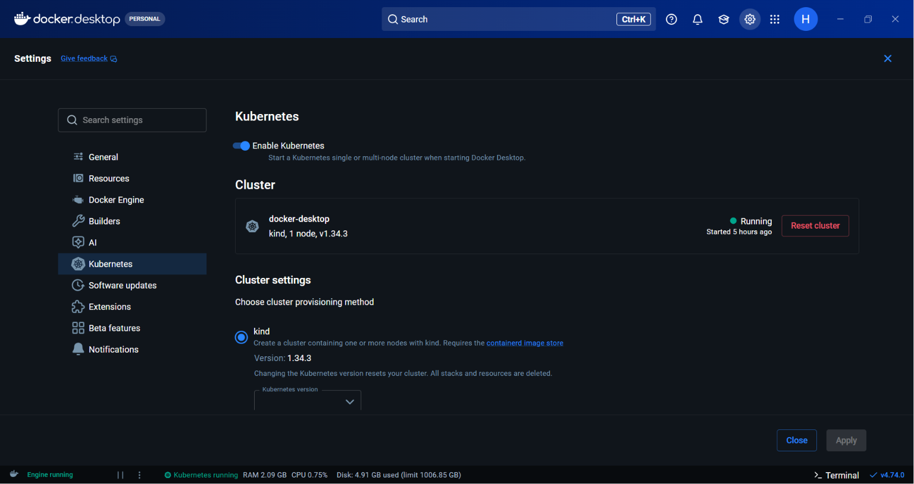

### kubectl Version

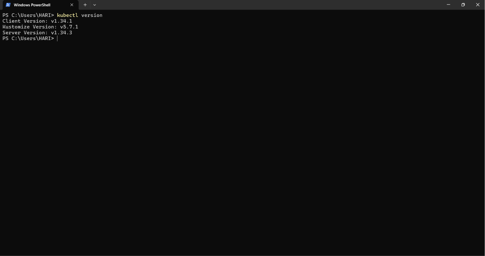

### Kubernetes Node

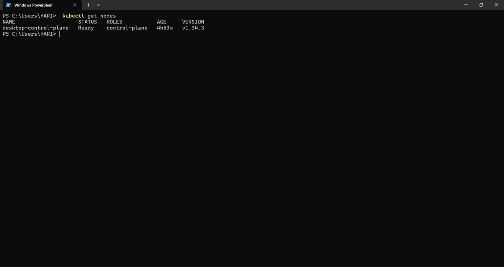

### Running Pods

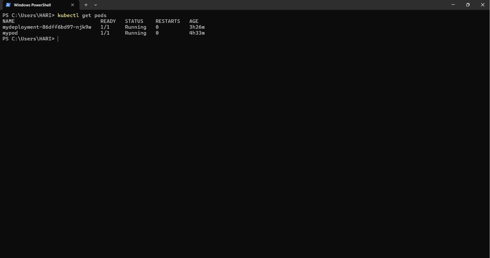

### Deployment Status

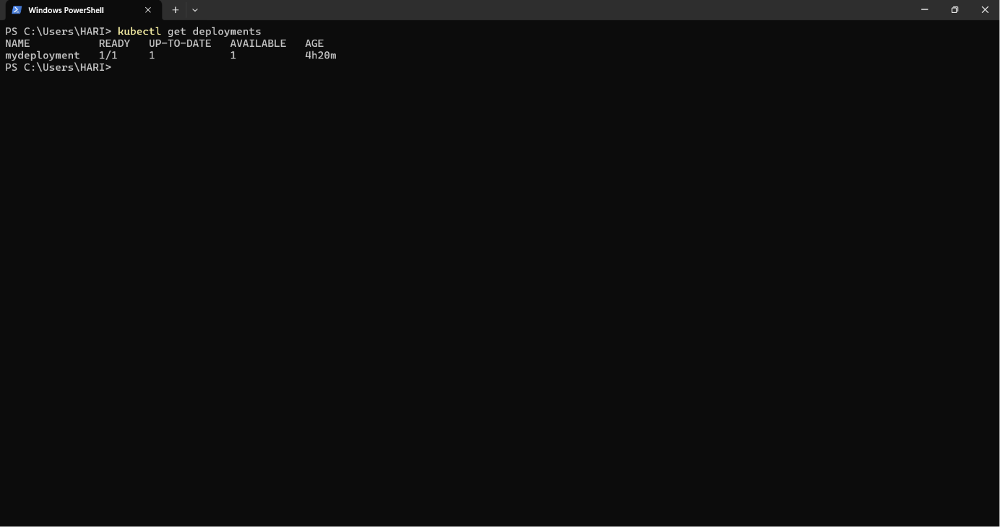

### Kubernetes Services

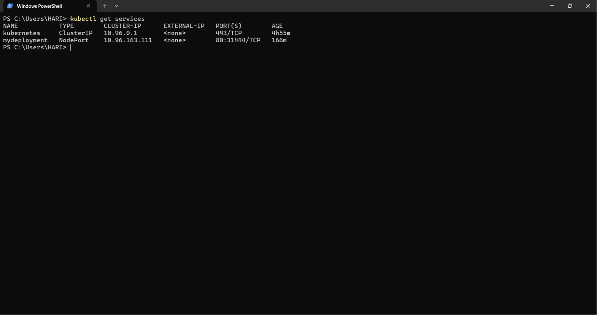

### Service Details

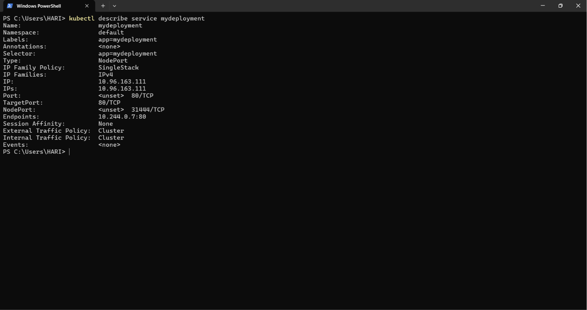

### Scaling Deployment

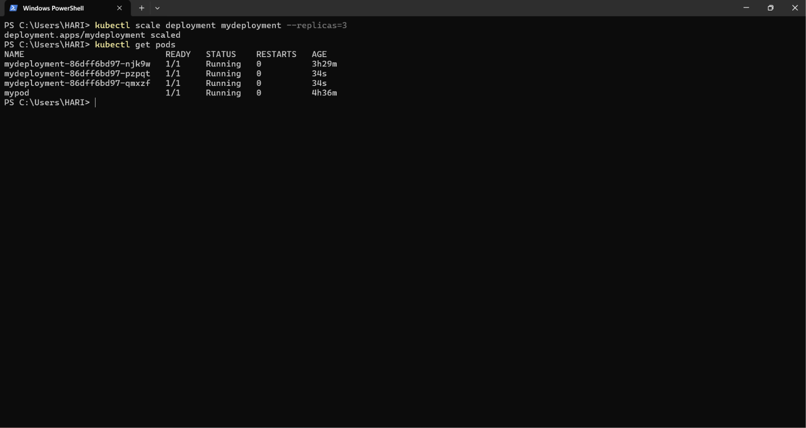

### NGINX Application

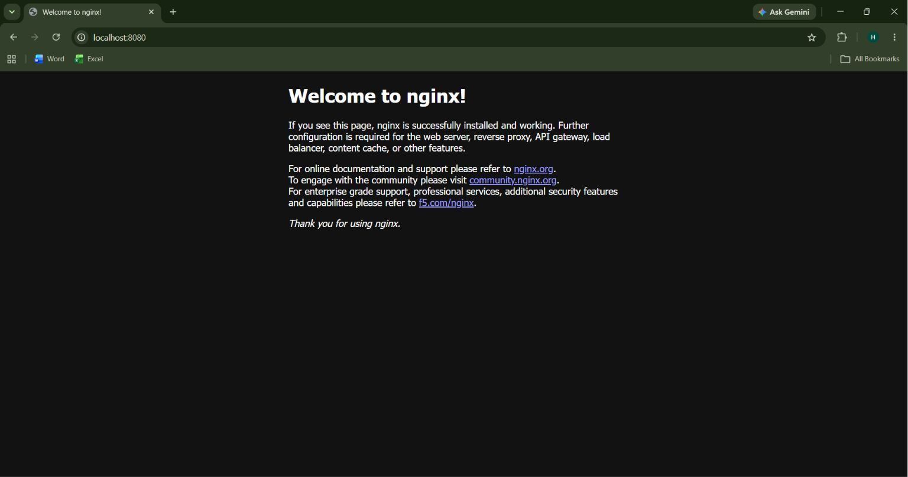

### Docker Desktop Kubernetes

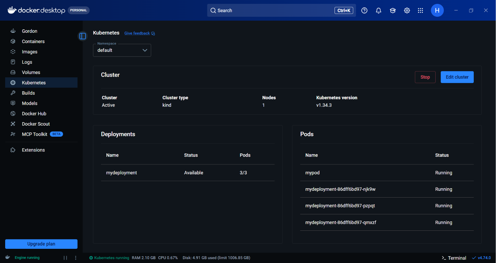

### Docker Images

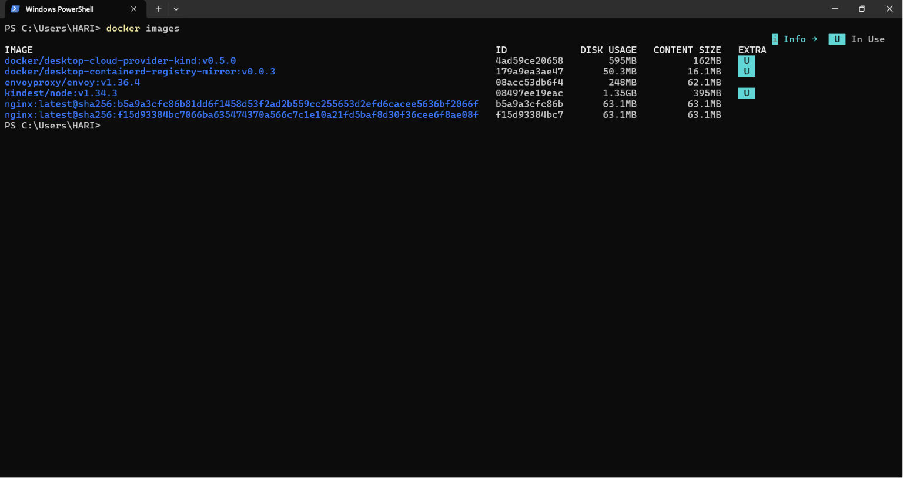

### Kubernetes Overview

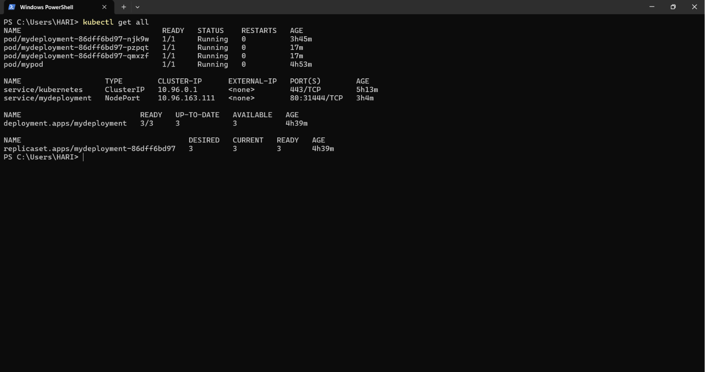

### Terraform Configuration (Part 1)

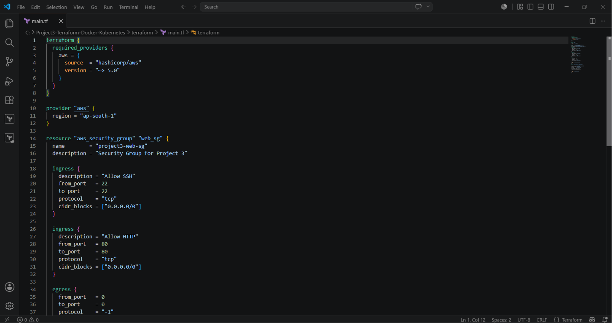

### Terraform Configuration (Part 2)

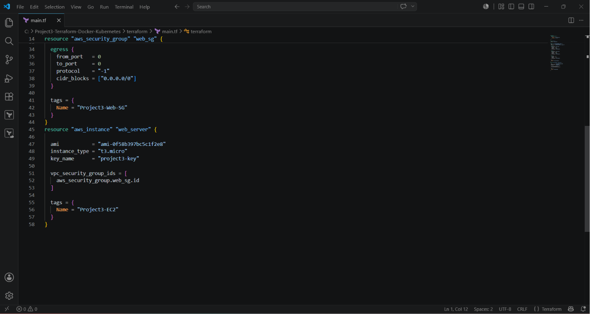

## Architecture

```
Terraform
     │
     ▼
AWS Infrastructure
(Security Group + EC2)

Docker Desktop
     │
     ▼
Docker Image
     │
     ▼
Kubernetes Deployment
     │
     ▼
Kubernetes Service (NodePort)
     │
     ▼
NGINX Web Application
```

## Technologies Used

- AWS EC2
- Terraform
- Docker Desktop
- Docker Engine
- Kubernetes
- kubectl
- NGINX
- Windows PowerShell

## Project Features

- Provision AWS resources using Terraform
- Deploy NGINX using Kubernetes
- Expose application using NodePort Service
- Scale Kubernetes deployment
- Verify Kubernetes cluster resources
- Docker Desktop Kubernetes integration
- Infrastructure managed using Infrastructure as Code (IaC)

## Project Structure

```
aws-terraform-docker-kubernetes/
│
├── README.md
├── screenshots/
│   ├── 01-kubernetes-cluster.png
│   ├── 02-kubectl-version.png
│   ├── ...
│   └── 14-terraform-main-2.png
│
└── terraform/
    └── main.tf
```

## Deployment Steps

1. Enable Kubernetes in Docker Desktop.
2. Verify the Kubernetes cluster using `kubectl`.
3. Create a Kubernetes Deployment.
4. Expose the Deployment using a NodePort Service.
5. Verify Pods, Deployments, Nodes, and Services.
6. Scale the deployment.
7. Access the NGINX application through the browser.
8. Provision AWS infrastructure using Terraform.

## Terraform Configuration

The Terraform configuration provisions:

- AWS Security Group
- EC2 Instance
- SSH (Port 22) access
- HTTP (Port 80) access

Terraform files are available in the `terraform/` directory.

## Future Improvements

- Deploy application to Amazon EKS
- Automate deployment using GitHub Actions
- Use Terraform modules
- Integrate Helm charts
- Add monitoring with Prometheus and Grafana

## Author

**Hariharan R**

GitHub: https://github.com/hariharan-r-cloud
